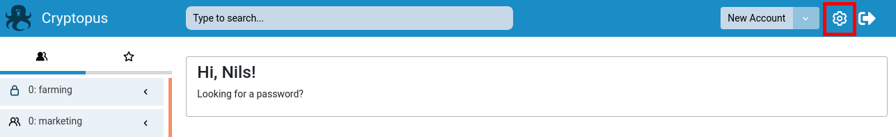
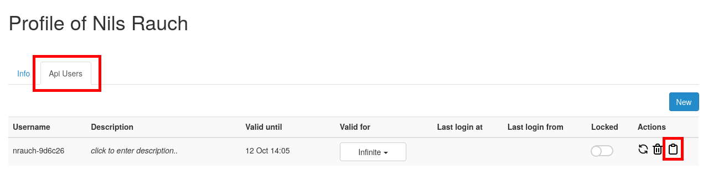

# Receiving the Login token from Cryptopus

To use the CCLI, you'll first have to receive the login token from Cryptopus.

1. Log in to your instance of Cryptopus
2. Navigate to your user settings
3. Choose or create the api user you want to use via the ccli (keep the valid time in mind)
4. Use the ccli login copy button
5. Copy the command from your clipboard to the terminal

## Accessing user settings

## Copy CCLI Login

